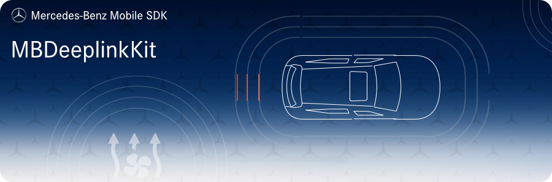

<!-- SPDX-License-Identifier: MIT -->



 


## Requirements
* __Minimum Android SDK:__ MBDeepLinkKit requires a minimum API level of 21. 
* __Compile Android SDK:__ MBDeepLinkKit requires you to compile against minimum API level 28.

## Intended Usage

This module contains logic to request and persist apps and deep links withing the app family.

### Initialization
Initialize the module within your application class. This requires the initialization of `MBNetworkKit`.

```kotlin
MBDeepLinkKit.init(
    DeepLinkServiceConfig.Builder(
        // BASE_URL is the URL to the REST APIs, depending on the region and stage.
        this, BASE_URL, MBNetworkKit.headerService()
    ).useSessionId(sessionId.toString())
    .build()
)
```

### Fetching apps and deep links

Request apps either from the REST API
```kotlin
MBDeepLinkKit.appsService().fetchAppsAndDeepLinks("my_jwt_token")
    .onComplete { apps: List<FamilyApp> ->
        // The request was successful.
    }.onFailure { error: ResponseError<out RequestError>? ->
        // The request failed.
    }
   
```
or from the local cache (only if the apps were successfully requested before)
```kotlin
MBDeepLinkKit.loadAppsAndDeepLinks()
```

### Opening apps and deep links
```kotlin
// Open an app.
val result = MBDeepLinkKit.openFamilyApp(context, familyApp)

// Open a deep link if it is available for a specific FIN/ VIN.
val result = MBDeepLinkKit.openDeepLink(context, deepLink, finOrVin)
```

## Installation

Add the following maven url to your project `build.gradle`:  
```gradle
allprojects {
    repositories {
        google()
        jcenter()
        maven {
            url 'https://pkgs.dev.azure.com/daimler-ris/sdk/_packaging/release/maven/v1'
        }
    }
}
```

Add to your app's `build.gradle`:  
```gradle
implementation "com.daimler.mm:MBDeepLinkKit:$mb_deeplink_kit_version"
```

## Building
In order to build & run the sample locally you need a valid plain JWT token to 
execute REST requests provided by MBDeepLinkKit.  
Add the following line to your `local.properties` file:  
```gradle
TEST_TOKEN=<my_jwt_token>
```

## Contributing

We welcome any contributions.
If you want to contribute to this project, please read the [contributing guide](CONTRIBUTING.md).

## Code of Conduct

Please read our [Code of Conduct](https://github.com/Daimler/daimler-foss/blob/master/CODE_OF_CONDUCT.md) as it is our base for interaction.

## License

This project is licensed under the [MIT LICENSE](LICENSE).

## Provider Information

Please visit <https://mbition.io/en/home/index.html> for information on the provider.

Notice: Before you use the program in productive use, please take all necessary precautions,
e.g. testing and verifying the program with regard to your specific use.
The program was tested solely for our own use cases, which might differ from yours.
